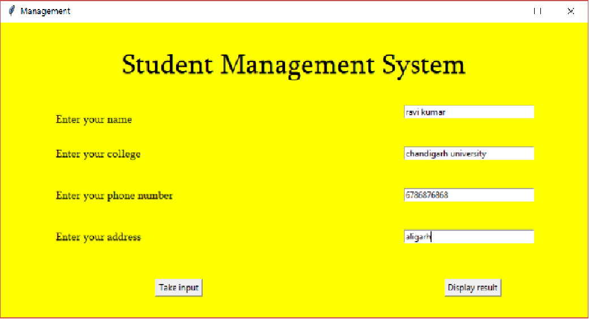
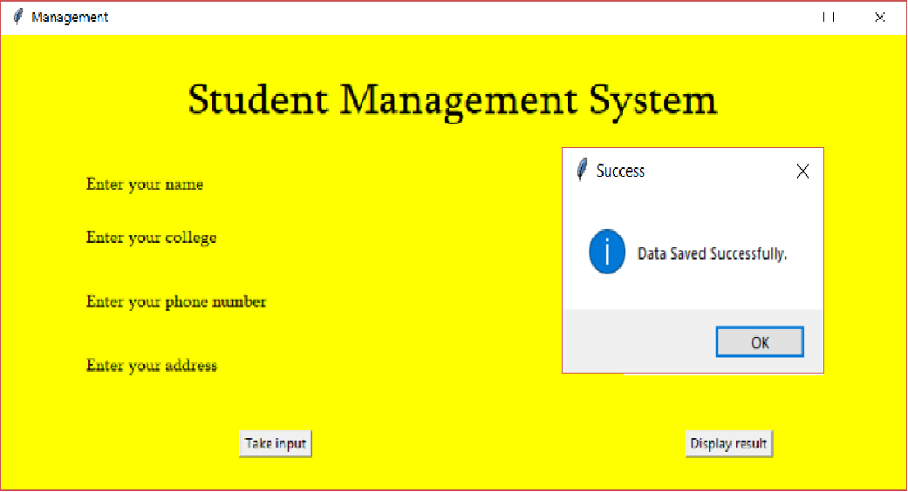
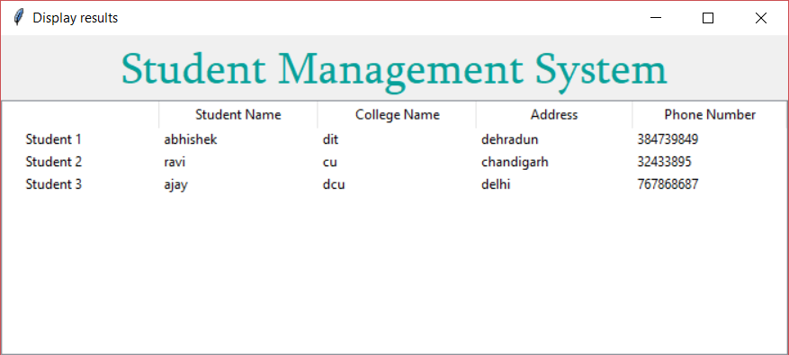

# student-management-system

## topics covered

    1.student management system.
    2.using tkinter.
    3.using sqlite3.
    4.taking input
    5.displaying results
    
 ## screenshots
 
 
 
 
